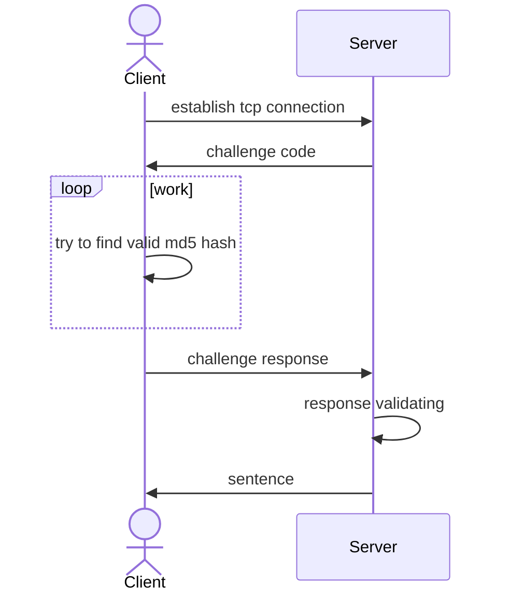

# Test task for Server engineer (Go)

## another header

### Usage

Run all-in-one by

```bash
make run-all-in-one
```

### Build

Build docker containers by

``` bash
make docker-build-client
make docker-build-server
```

### Diagram

yes, pictures are fun



### Комментарии

Задумка была сделать тестовое задание примерно примерно в стиле, как сформулирована задача, максимально просто и коротко. Функционал который кажется не обязательный в реализацию максимально был не включен.

#### +- мин тесты

Юнит тестами покрыт  функционал, который можно ими протестировать. В сервисе и клиенте бизнес логика отсутствует, поэтому отсутствуют и юнит тесты. Проверять их совместную работу сервиса/клиента нужно интеграционным тестированием, которое будут выглядеть сложнее чем ручной запуск сервиса/клиента.

#### - в хелпере не очень аккуратная обработка ошибок (io.EOF)

В данной рализии хелпер предназначен только для чтения из TCP соединения и не предназначен для обработки ошибок. В позитивном сценарии io.EOF не должно возникать. Если она возникает - она должна быть обработана на уровне приложения.

#### - использование не очень известных пакетов ( github.com/goava/slice )

Пакет позволяет сделать код запуска очень емким и коротким. Отлично подходит для небольших проектов.

#### ? как следствие предыдущего пункта не очень понятна, как graceful shutdown обрабатывается (беглый взгляд по либе и локальные запуски говорят,что как будто норм работает)

graceful shutdown обеспечивается через реализацию метода ```Run``` и отмену контекста

#### - нет конфигов

Сам механизм конфигурации - предусмотрен, в обновленной версии в конфигурацию добавлены параметры таймаутов. Для наглядности я добавил в явном виде файлы конфигурации в директорию envs.

```env
SENTENCE_SERVICE_ADDRESS=localhost:8099
SERVICE_WRITE_TIMEOUT=1s
SERVICE_CHALLENGE_TIMEOUT=500ms
```

Без файлов конфигурации сервисы так же запускаются с дефолтными параметрами.

```go
type Parameters struct {
 Address          string        `envconfig:"SENTENCE_SERVICE_ADDRESS" default:"localhost:8090"`
 WriteTimeout     time.Duration `envconfig:"SERVICE_WRITE_TIMEOUT" default:"1s"`
 ChallengeTimeout time.Duration `envconfig:"SERVICE_CHALLENGE_TIMEOUT" default:"10s"`
}
```

#### - нет таймаутов

Добавлены таймауты. В клиенте добавлен функционал регулярной проверки  за тем что соединение еще открыто.

#### - нет разбивки по пакетам (хотя бы минимальный пакет стораджа цитат)

Добавил трехслойную архитектуру внутри сервера.
