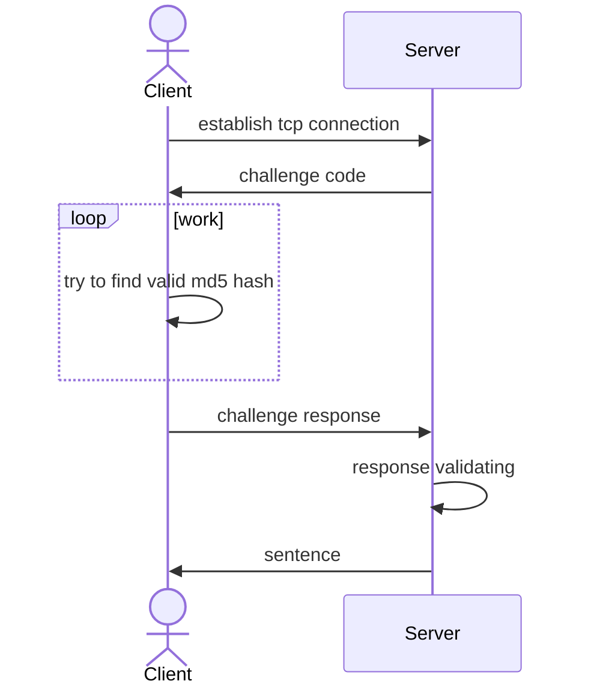

# Test task for Server engineer (Go)

## another header

### Usage

Run all-in-one by

```bash
make run-all-in-one
```

### Build

Build docker containers by

``` bash
make docker-build-client
make docker-build-server
```

### Diagram

yes, pictures are fun


